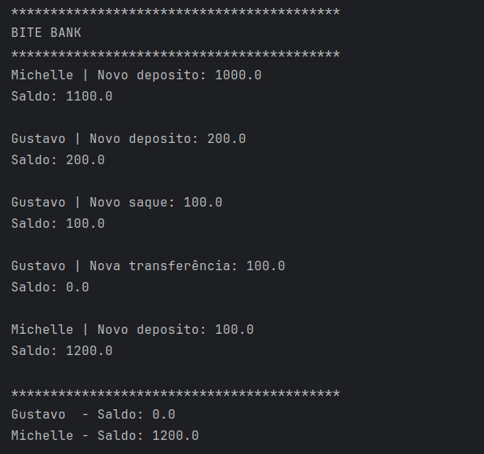

# Bytebank

O Bytebank é um projeto em Kotlin que simula um banco de dados digital. O App trata-se de uma aplicação em console, ou
seja, para apresentar resultados diferentes, é necessário modificar o código fonte e executá-lo novamente.

## 🔨 Funcionalidades do projeto

A partir do App você pode:

- Criar contas
- Depositar e sacar dinheiro
- Transferir dinheiro entre as contas

  

## ✔️ Técnicas e tecnologias utilizadas

Neste App são exploradas as seguintes técnicas e tecnologias:

- **Função `main()`**: inicia o programa
- **Variáveis mutáveis e imutáveis**: armazenar valores que podem ou não ser modificados
- **Operações aritméticas**: soma, subtração, multiplicação e divisão
- **Auto incremento**: adição incremental na mesma variável
- **Strings e String template**: utilização de texto e concatenação de texto com variáveis ou funções
- **Estrutura condicional**: `if` e `when`
- **Estrutura de repetição ou laços**: `while` e `for` loop
- **Implementação de classes**: definição de conta
- **Criação de objetos**: instâncias para criar novas contas
- **Construtores**: definição de como criar objetos
- **Properties**: mecanismo para acessar campos/atributos das classes
- **Métodos**: comportamentos da classe
- **Parâmetros nomeados**: envio de argumentos especifícos para construtores, métodos ou funções
- **Métodos de acesso**: restrição de acesso de membros de classe

## 📁 Acesso ao projeto

Você
pode [baixar o zip](https://github.com/alura-cursos/kotlin-introducao-orientacao-a-objetos/archive/refs/heads/aula-5.zip)
ou [acessar o código fonte](https://github.com/alura-cursos/kotlin-introducao-orientacao-a-objetos/tree/aula-5) do
projeto final:

## 🛠️ Abrir e rodar o projeto

O projeto foi desenvolvido no IntelliJ IDEA, sendo assim, instale o IntelliJ (pode ser uma versão mais recente) e, na
tela de launcher, procure a opção **Open** e clique nela. Deve apresentar um explorador de arquivos, procure o projeto
em seu computador.

> Caso baixou o zip, extraia o projeto antes de procurá-lo, pois não é possível abrir via arquivo zip

Após selecionar o projeto, clique em **OK** deve abrir o projeto. Apos abrir o projeto e finalizar todas as tarefas de
configuração do projeto, abra o arquivo **sec/main.kt** e rode a função `main()` dele, se tudo ocorrer como esperado,
deve apresentar um resultado no console com todas as funcionalidades implementadas. 🏆

> Caso não rodar, muito provavelmente, precisa configurar o SDK do projeto, ou seja, a JDK que o Kotlin vai usar para
> rodar os códigos na JVM, clique nas opções de configuração e selecione a JDK disponível no seu computador. O projeto
> foi
> testado em versões 11 e 12 da JDK, portanto, tente nas mesmas versões.

## 📚 Mais informações do curso

Gostou do projeto e quer conhecer mais? Você
pode [acessar o curso que desenvolve o projeto desde o começo](https://www.alura.com.br/curso-online-kotlin-orientacao-objetos)!

Esse curso faz parte da [formação de Kotlin da Alura](https://www.alura.com.br/formacao-kotlin)